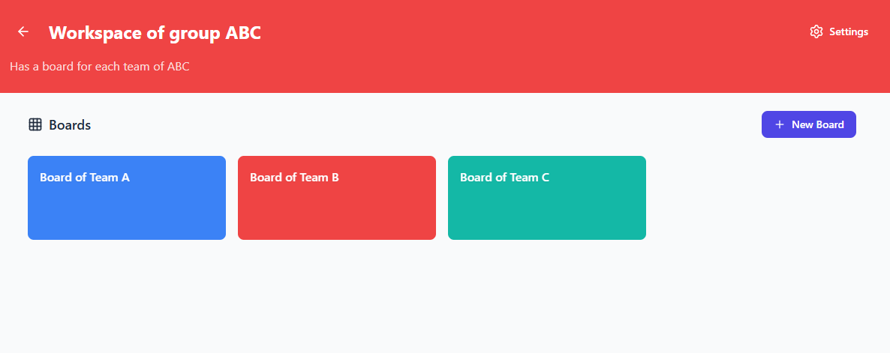
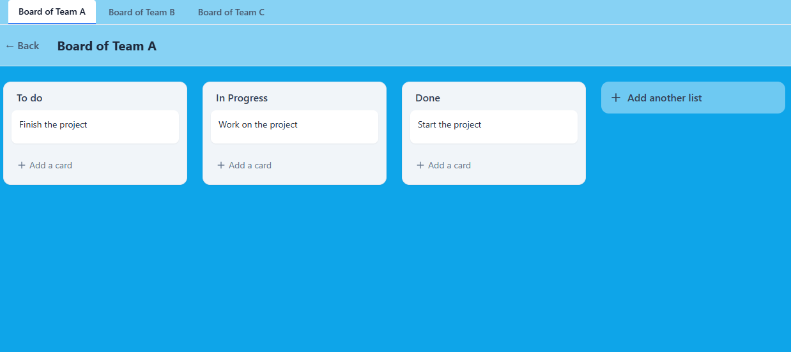

# TaskFlow

TaskFlow is web application inspired by Trello, an app that help project management with the help of Kanban boars.
User can create boards, manager cards, assign member, comment, set due date and collaborate in real time in TaskFlow.

---

## Run Locally

**Prerequisites:**  Node.js

1. Install dependencies:
   `npm install`
2. Run the app:
   `npm run dev`

## Run with Docker

**Prerequisites:** Docker

1. Launch App & Database:
   `sudo docker compose up --build -d`
2. Initialize the Database:
   `sudo docker compose exec app npx prisma db push`

## Database Management

**Prerequisites:** Docker

1. Prisma Studio:
   `sudo docker compose exec app npx prisma studio --port 5555 --browser none`

2. sync the changes with:
   `sudo docker compose exec app npx prisma generate |
    sudo docker compose exec app npx prisma db push`

---

## Technologies

Frontend : Next.js (React, TypeScript)\
Backend : Node.js / API REST\
Database : PostgreSQL\
Authentification : OAuth2 + JWT\
Real Time interaction : WebSockets\
Drag & Drop : dnd-kit\
Deployment : Fly.io

---

## Features

- Authentification
- Board Creation
- Lists & Cards
- Drag & Drop
- Labels
- Due Dates
- Commentaries
- Permission management
- Real Time interaction
- Gantt Diagram

---

## Documentation

- [User Guide](./docs/USER_GUIDE.md)
- [Commit Format](./docs/COMMIT_FORMAT.md.md)

---

## Architecture

`Client (Next.js) →
API REST →
PostgreSQL`

