# TaskFlow - Guide Utilisateur Complet

**Version :** 2.0
**Auteurs :** Tovy REN et Jonathan Jalmain
**Date :** 12/03/2026

---

## Table des matieres

1. [Introduction](#1-introduction)
2. [Inscription et Authentification](#2-inscription-et-authentification)
3. [Navigation Generale](#3-navigation-generale)
4. [Gestion des Workspaces](#4-gestion-des-workspaces)
5. [Gestion des Boards (Tableaux)](#5-gestion-des-boards-tableaux)
6. [Gestion des Listes](#6-gestion-des-listes)
7. [Gestion des Cartes (Taches)](#7-gestion-des-cartes-taches)
8. [Detail d'une Carte](#8-detail-dune-carte)
9. [Drag & Drop](#9-drag--drop)
10. [Vue Gantt (Timeline)](#10-vue-gantt-timeline)
11. [Notifications](#11-notifications)
12. [Roles et Permissions](#12-roles-et-permissions)
13. [Panneau d'Administration Workspace](#13-panneau-dadministration-workspace)
14. [Panneau d'Administration Board](#14-panneau-dadministration-board)
15. [Collaboration en Temps Reel](#15-collaboration-en-temps-reel)
16. [Deconnexion](#16-deconnexion)

---

## 1. Introduction

TaskFlow est une application web de gestion de projet inspiree de Trello. Elle permet d'organiser vos projets a l'aide de tableaux Kanban, de listes, et de cartes. Vous pouvez assigner des membres, suivre les deadlines, ajouter des checklists, commenter les taches, et collaborer en temps reel avec votre equipe.

L'application est structuree en trois niveaux :
- **Workspace** : regroupe plusieurs boards et membres
- **Board** : un tableau Kanban contenant des listes
- **Carte/Tache** : un element de travail individuel dans une liste

> 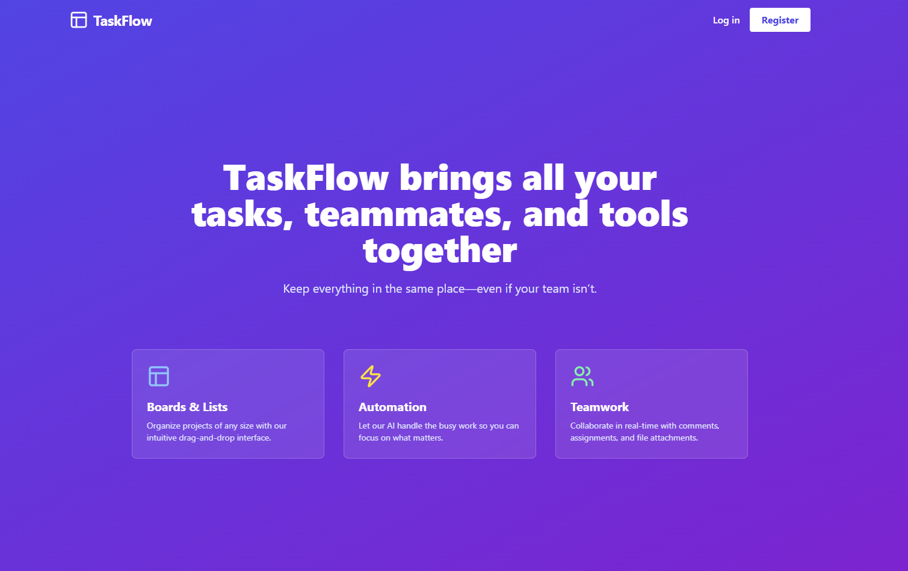
> *Capture : Page d'accueil de TaskFlow montrant le hero et les fonctionnalites principales*

---

## 2. Inscription et Authentification

### 2.1 Creer un compte

1. Cliquez sur **"Register"** en haut a droite de la page d'accueil.
2. Remplissez les champs :
   - **Nom complet** (obligatoire)
   - **Adresse email** (obligatoire)
   - **Mot de passe** (obligatoire)
3. Cliquez sur **"Sign Up"**.

> 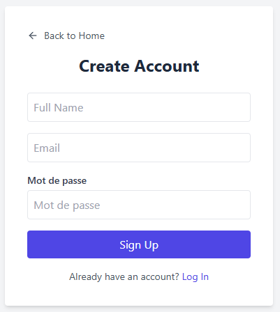
> *Capture : Formulaire d'inscription avec indicateur de force du mot de passe*

#### Exigences du mot de passe

Le mot de passe doit respecter les criteres suivants :
- Minimum **8 caracteres**
- Au moins **une lettre majuscule** (A-Z)
- Au moins **une lettre minuscule** (a-z)
- Au moins **un chiffre** (0-9)
- Au moins **un caractere special** (!@#$%^&*()_+-=[]{}';:"\|,.<>/?)

Un indicateur visuel affiche la force du mot de passe en temps reel :
- Rouge : Tres faible
- Orange : Faible
- Jaune : Moyen
- Vert clair : Bon
- Vert : Fort

> 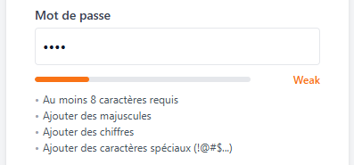
> *Capture : Les differents niveaux de force du mot de passe*

### 2.2 Se connecter

#### Connexion classique (Email + Mot de passe)

1. Cliquez sur **"Log in"** en haut a droite.
2. Entrez votre **adresse email** et votre **mot de passe**.
3. Cliquez sur **"Sign In"**.

> 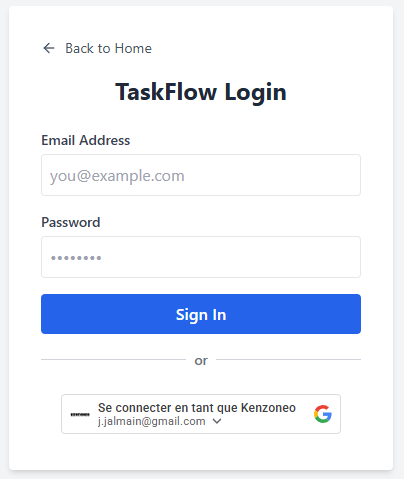
> *Capture : Formulaire de connexion avec les deux methodes d'authentification*

#### Connexion via Google (OAuth2)

1. Sur la page de connexion, cliquez sur le bouton **"Continuer avec Google"**.
2. Selectionnez votre compte Google.
3. L'application cree automatiquement votre compte si c'est votre premiere connexion, ou le relie a un compte existant si le meme email est deja enregistre.

> 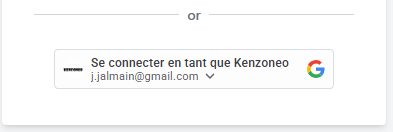
> *Capture : Bouton de connexion Google sur la page de login*

---

## 3. Navigation Generale

Apres connexion, vous accedez a la **liste de vos Workspaces**. La navigation se fait de maniere hierarchique :

```
Workspaces → Board → Listes → Cartes
```

**Barre de navigation (Header)** :
- **Logo TaskFlow** (a gauche) : cliquez pour revenir a la liste des workspaces
- **Cloche de notifications** (a droite) : affiche le nombre de notifications non lues
- **Avatar utilisateur** (a droite) : affiche votre nom
- **Bouton Logout** (a droite) : pour se deconnecter

> 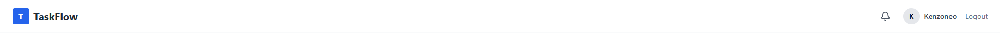
> *Capture : Barre de navigation avec les elements principaux*

---

## 4. Gestion des Workspaces

### 4.1 Vue d'ensemble des Workspaces

La page principale affiche tous vos workspaces sous forme de cartes. Chaque carte montre :
- Le **nom** du workspace
- Sa **description** (si definie)
- Le **nombre de boards**
- Le **nombre de membres**
- La **couleur** du workspace

> 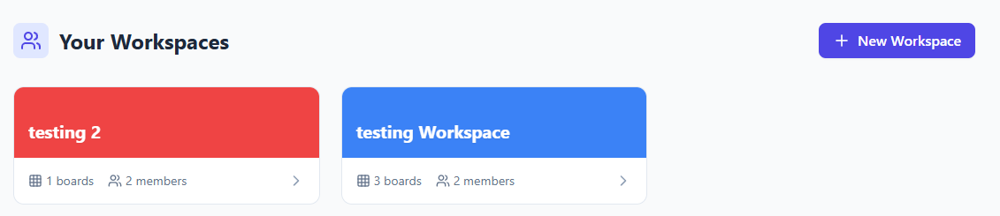
> *Capture : Vue d'ensemble des workspaces avec les compteurs de boards et membres*

### 4.2 Creer un Workspace

1. Cliquez sur le bouton **"New Workspace"** en haut a droite.
2. Remplissez :
   - **Nom du workspace** (obligatoire)
   - **Description** (optionnel)
   - **Couleur** : choisissez parmi 10 couleurs predefinies
3. Cliquez sur **"Create"**.

> 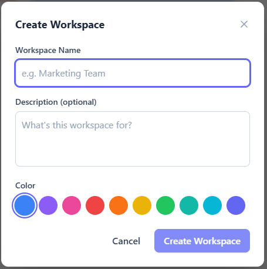
> *Capture : Formulaire de creation d'un nouveau workspace*

### 4.3 Vue d'un Workspace

Cliquez sur un workspace pour voir son contenu :
- **Header colore** avec le nom du workspace
- **Description** du workspace
- **Grille de boards** : tous les tableaux du workspace
- **Barre laterale des membres** (a droite) : liste des membres et invitations en attente
- **Bouton "Settings"** (admins uniquement) : ouvre le panneau d'administration

> 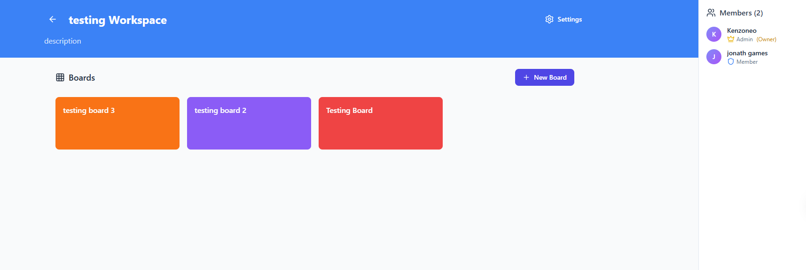
> *Capture : Vue interieure d'un workspace avec ses boards et la liste des membres*

### 4.4 Inviter des membres

1. Allez dans **Settings** > onglet **Invitations**.
2. Entrez l'**adresse email** de la personne a inviter.
3. Selectionnez le **role** a attribuer (Admin, Member, Viewer).
4. Cliquez sur **"Send Invite"**.

L'invite recevra une **notification** dans l'application. Si son email correspond a un compte existant (classique ou Google), la notification apparaitra en temps reel.

> 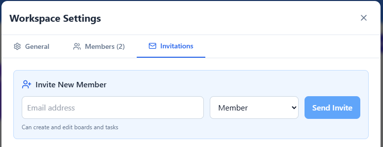
> *Capture : Section d'invitation de membres avec le choix du role*

### 4.5 Gerer les invitations en attente

Les invitations en attente sont visibles :
- Dans la **barre laterale des membres** du workspace
- Dans l'onglet **Invitations** du panneau d'administration

Pour annuler une invitation : cliquez sur le bouton **"Cancel"** a cote de l'invitation.

> 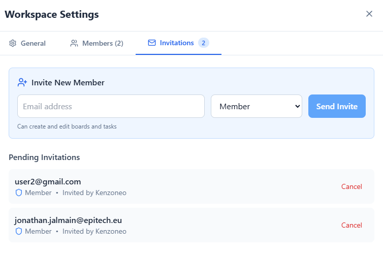
> *Capture : Liste des invitations en attente avec option d'annulation*

---

## 5. Gestion des Boards (Tableaux)

### 5.1 Creer un Board

1. Dans un workspace, cliquez sur **"New Board"**.
2. Remplissez :
   - **Titre du board** (obligatoire)
   - **Couleur de fond** : 8 couleurs disponibles
3. Cliquez sur **"Create"**.

Le board apparait immediatement dans la grille du workspace.

> 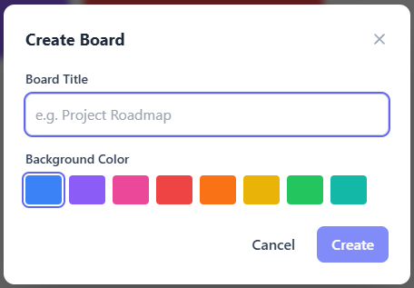
> *Capture : Modal de creation d'un nouveau board avec choix de couleur*

### 5.2 Ouvrir un Board

Cliquez sur un board pour l'ouvrir. Vous arriverez sur la **vue Kanban** par defaut.

### 5.3 Supprimer un Board

1. Survolez la carte du board dans le workspace.
2. Cliquez sur l'icone **menu (trois points)**.
3. Selectionnez **"Delete Board"**.

> 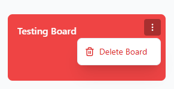
> *Capture : Menu contextuel avec l'option de suppression d'un board*

### 5.4 Interface du Board

La vue board comprend :
- **Bouton retour** : pour revenir au workspace
- **Titre du board**
- **Onglets** : bascule entre **Board** (Kanban) et **Timeline** (Gantt)
- **Bouton Settings** (admins) : ouvre le panneau d'administration du board
- **Navigation par onglets** : liste de tous les boards du workspace pour navigation rapide

> 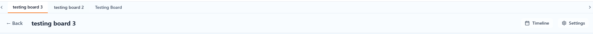
> *Capture : Vue complete d'un board avec son header, ses listes et ses cartes*

---

## 6. Gestion des Listes

### 6.1 Creer une Liste

1. Scrollez a droite dans le board jusqu'au bouton **"Add another list"**.
2. Entrez le **titre** de la liste.
3. Appuyez sur **Entree** ou cliquez sur **"Add List"**.

> 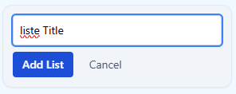
> *Capture : Formulaire de creation d'une nouvelle liste*

### 6.2 Renommer une Liste

**Methode 1 - Clic direct :**
1. Cliquez sur le **titre de la liste** dans le header.
2. Le titre devient editable.
3. Modifiez le texte et appuyez sur **Entree**.

**Methode 2 - Menu :**
1. Cliquez sur l'icone **menu (trois points)** dans le header de la liste.
2. Selectionnez **"Rename List"**.
3. Modifiez le titre et confirmez.

> 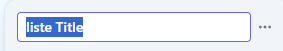
> *Capture : Edition inline du titre d'une liste*

### 6.3 Changer la couleur du header

1. Cliquez sur l'icone **menu** de la liste.
2. Dans la section **"Header Color"**, choisissez parmi 9 couleurs :
   - Defaut (transparent), Rouge, Orange, Ambre, Vert, Bleu, Indigo, Violet, Rose

> 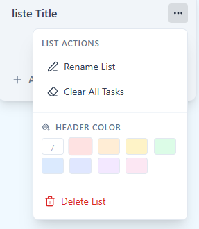
> *Capture : Selecteur de couleur du header de liste*

### 6.4 Vider une Liste

1. Cliquez sur le **menu** de la liste.
2. Selectionnez **"Clear All Tasks"**.
3. Confirmez dans la boite de dialogue.

Toutes les cartes de la liste seront supprimees. Cette action est irreversible.

### 6.5 Supprimer une Liste

1. Cliquez sur le **menu** de la liste.
2. Selectionnez **"Delete List"**.
3. Confirmez dans la boite de dialogue.

La liste et toutes ses cartes seront supprimees. Cette action est irreversible.

> 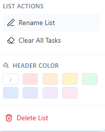
> *Capture : Menu contextuel d'une liste avec toutes les options disponibles*

---

## 7. Gestion des Cartes (Taches)

### 7.1 Creer une Carte

1. Cliquez sur **"Add a card"** en bas d'une liste.
2. Entrez le **titre** de la carte.
3. Appuyez sur **Entree** ou cliquez sur **"Add Card"**.
4. Cliquez sur **X** pour annuler.

> 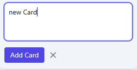
> *Capture : Zone de saisie pour creer une nouvelle carte dans une liste*

### 7.2 Apercu d'une Carte (vue Kanban)

Chaque carte affiche un resume visuel :
- **Labels** : pastilles colorees (jusqu'a 4 affichees)
- **Titre** de la tache
- **Date d'echeance** : badge avec icone horloge
  - Rouge si la date est depassee
  - Gris si la date est dans le futur
- **Checklist** : progression (ex: "3/5")
- **Commentaires** : nombre de commentaires
- **Assignes** : avatars des membres (3 max + "+N" si plus)

> 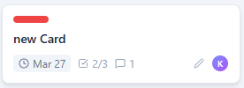
> *Capture : Exemple de carte avec labels, date, checklist, commentaires et assignes*

### 7.3 Ouvrir le Detail d'une Carte

Cliquez sur une carte pour ouvrir le **modal de detail**. Voir la section [Detail d'une Carte](#8-detail-dune-carte).

---

## 8. Detail d'une Carte

Le modal de detail d'une carte est divise en deux parties :
- **Zone principale** (a gauche) : informations et contenu de la carte
- **Barre laterale** (a droite) : actions pour ajouter des elements

> 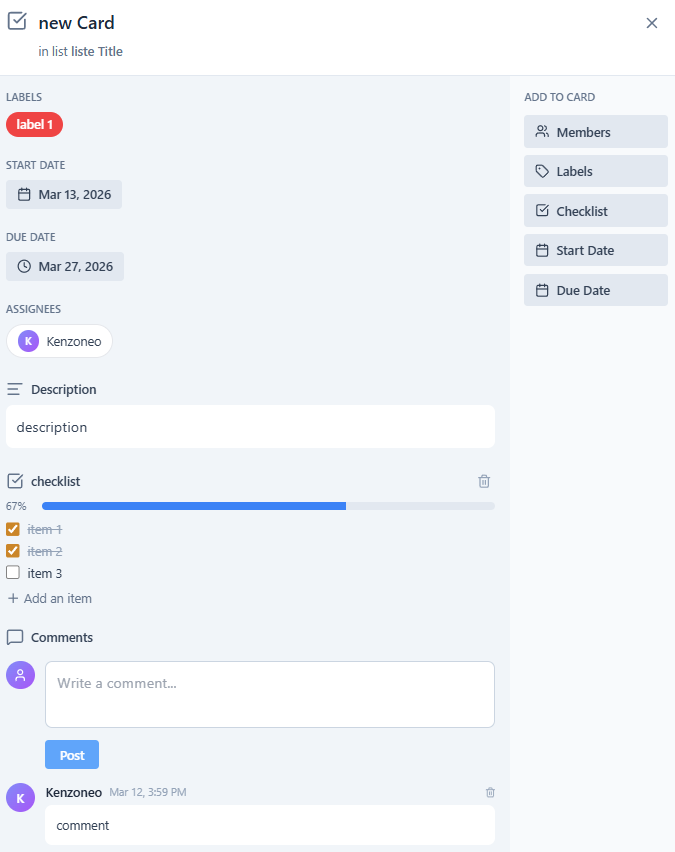
> *Capture : Vue complete du modal de detail d'une carte*

### 8.1 Modifier le Titre

1. Cliquez sur le **titre** de la carte dans le header du modal.
2. Le titre devient editable.
3. Modifiez le texte et appuyez sur **Entree** pour sauvegarder.
4. Cliquez ailleurs pour annuler.

### 8.2 Modifier la Description

1. Cliquez sur la zone de description (ou le texte **"Add a more detailed description..."**).
2. Un editeur de texte apparait.
3. Redigez votre description.
4. Cliquez sur **"Save"** pour enregistrer ou **"Cancel"** pour annuler.

> 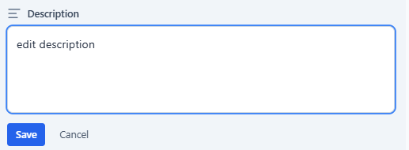
> *Capture : Zone d'edition de la description d'une carte*

### 8.3 Gerer les Membres (Assignes)

1. Dans la barre laterale, cliquez sur **"Members"**.
2. Un dropdown affiche tous les **membres du workspace**.
3. Cliquez sur un membre pour l'**assigner** ou le **desassigner** (toggle).
4. Un **check** vert indique les membres deja assignes.

Les membres assignes apparaissent :
- Dans le detail de la carte (section Assignees)
- Sur la carte en vue Kanban (avatars)

> 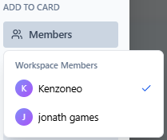
> *Capture : Dropdown de selection des membres avec indicateurs d'assignation*

### 8.4 Gerer les Labels

1. Dans la barre laterale, cliquez sur **"Labels"**.
2. Un dropdown affiche tous les **labels du board**.
3. Cliquez sur un label pour l'**ajouter** ou le **retirer** (toggle).
4. Un **check** vert indique les labels deja appliques.

Les labels apparaissent :
- Dans le detail de la carte (badges colores avec nom)
- Sur la carte en vue Kanban (pastilles colorees)

> 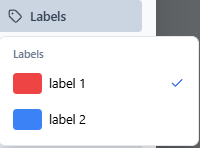
> *Capture : Dropdown de selection des labels avec apercu des couleurs*

### 8.5 Definir une Date de Debut

1. Dans la barre laterale, cliquez sur **"Start Date"**.
2. Un selecteur de date apparait.
3. Choisissez la date souhaitee.
4. Pour supprimer la date, cliquez sur **"Remove start date"**.

### 8.6 Definir une Date d'Echeance (Due Date)

1. Dans la barre laterale, cliquez sur **"Due Date"**.
2. Un selecteur de date apparait.
3. Choisissez la date souhaitee.
4. Pour supprimer la date, cliquez sur **"Remove due date"**.

La date d'echeance est codee par couleur :
- **Rouge** : date depassee (overdue)
- **Gris** : date dans le futur

> 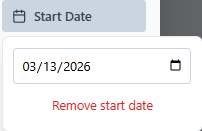
> *Capture : Selecteur de date avec option de suppression*

### 8.7 Gerer les Checklists

#### Creer une Checklist

1. Dans la barre laterale, cliquez sur **"Checklist"**.
2. Entrez le **titre** de la checklist.
3. Cliquez sur **"Add"** ou appuyez sur **Entree**.

Vous pouvez creer **plusieurs checklists** par carte.

> 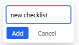
> *Capture : Formulaire de creation d'une nouvelle checklist*

#### Ajouter un Element

1. Cliquez sur **"Add an item"** sous une checklist.
2. Entrez le texte de l'element.
3. Cliquez sur **"Add"** ou appuyez sur **Entree**.

#### Cocher/Decocher un Element

Cliquez sur la **case a cocher** a gauche de l'element. Les elements coches sont barres et grises.

#### Supprimer un Element

Survolez l'element et cliquez sur le **X** qui apparait a droite.

#### Supprimer une Checklist

Cliquez sur l'icone **poubelle** a cote du titre de la checklist.

#### Barre de Progression

Chaque checklist affiche une **barre de progression** :
- **Bleu** : progression en cours
- **Vert** : 100% complete
- Pourcentage affiche a gauche

> 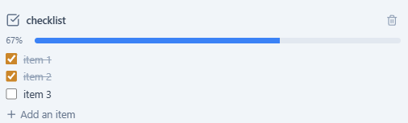
> *Capture : Checklist avec barre de progression, elements coches et non coches*

### 8.8 Commentaires

#### Ajouter un Commentaire

1. Scrollez jusqu'a la section **"Comments"**.
2. Ecrivez votre commentaire dans le champ de texte.
3. Cliquez sur **"Post"**.

#### Supprimer un Commentaire

Vous ne pouvez supprimer que **vos propres commentaires**. Cliquez sur l'icone **poubelle** a cote du commentaire.

Chaque commentaire affiche :
- **Avatar** de l'auteur
- **Nom** de l'auteur
- **Date et heure** de publication
- **Texte** du commentaire

> 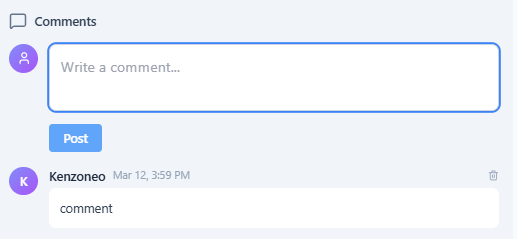
> *Capture : Section commentaires avec formulaire de saisie et historique*

---

## 9. Drag & Drop

### 9.1 Deplacer une Carte

1. **Cliquez et maintenez** sur une carte.
2. La carte s'anime (rotation + zoom) pour indiquer le mode drag.
3. **Glissez** la carte vers :
   - Une autre position dans la meme liste (reordonner)
   - Une autre liste (deplacer)
4. **Relachezz** pour deposer la carte.

> 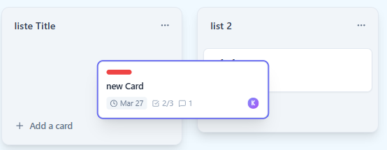
> *Capture : Une carte en cours de deplacement entre deux listes*

### 9.2 Reordonner les Listes

1. **Cliquez et maintenez** sur le header d'une liste.
2. **Glissez** la liste vers la gauche ou la droite.
3. **Relachez** pour deposer la liste a sa nouvelle position.

> 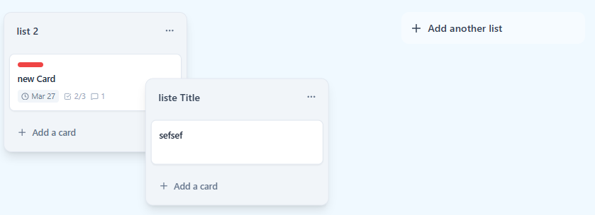
> *Capture : Une liste en cours de deplacement*

### Retour visuel

- La carte/liste draggee presente un **effet de rotation et de zoom**
- Un **contour bleu (ring)** entoure l'element en cours de deplacement
- La zone de depot se **surligne** au survol

---

## 10. Vue Gantt (Timeline)

### 10.1 Acceder a la Vue Gantt

1. Ouvrez un board.
2. Cliquez sur l'onglet **"Timeline"** dans le header du board.

> 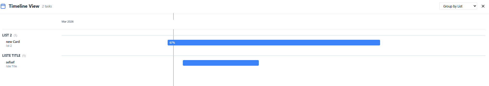
> *Capture : Vue timeline/Gantt avec les barres de taches sur la frise chronologique*

### 10.2 Comprendre la Vue

- **Axe horizontal** : frise chronologique avec les mois
- **Ligne rouge verticale** : date du jour
- **Barres colorees** : duree de chaque tache (start date → due date)

#### Code couleur des barres :
| Couleur | Signification |
|---------|---------------|
| **Vert** | Tache terminee (100% de la checklist) |
| **Rouge** | Tache en retard (due date depassee) |
| **Jaune** | Tache due dans moins de 3 jours |
| **Bleu** | Tache en cours (delai normal) |

Chaque barre affiche le **pourcentage de progression** de la checklist.

### 10.3 Grouper les Taches

Utilisez le **dropdown "Group by"** pour organiser l'affichage :
- **Group by List** : taches regroupees par liste d'appartenance
- **Group by Assignee** : taches regroupees par membre assigne (+ section "Unassigned")

> 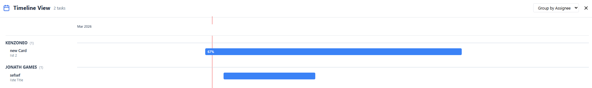
> *Capture : Vue Gantt regroupee par assignes avec les differentes sections*

### 10.4 Interagir avec le Gantt

- **Cliquez** sur une barre de tache pour ouvrir son detail
- **Survolez** une barre pour voir les dates exactes
- Seules les taches avec au moins une **date de debut ou d'echeance** apparaissent

> 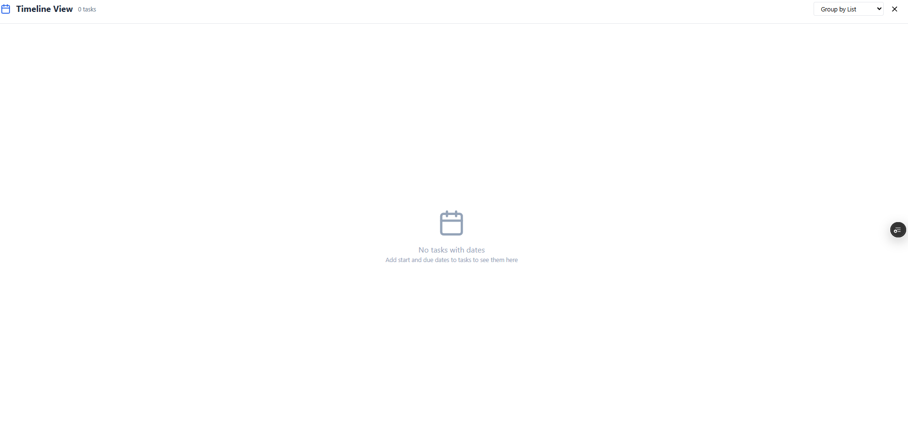
> *Capture : Message affiche quand aucune tache n'a de dates definies*

---

## 11. Notifications

### 11.1 Cloche de Notifications

La **cloche** dans la barre de navigation affiche un **badge rouge** avec le nombre de notifications non lues.

> 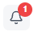
> *Capture : Icone de cloche avec badge de notifications non lues*

### 11.2 Types de Notifications

| Type | Icone | Description |
|------|-------|-------------|
| **Assignation** | Bleu (utilisateur) | Vous avez ete assigne a une tache |
| **Echeance proche** | Orange (horloge) | Une tache arrive a echeance |
| **Invitation workspace** | Violet (mail) | Vous etes invite a rejoindre un workspace |

### 11.3 Vue des Notifications

Cliquez sur la cloche pour ouvrir la **page de notifications** :
- **Bouton "Tout marquer comme lu"** : marque toutes les notifications comme lues
- **Liste chronologique** : notifications les plus recentes en premier
- **Point bleu** : indique une notification non lue
- **Fond bleu** : notifications non lues vs fond blanc pour les lues

> 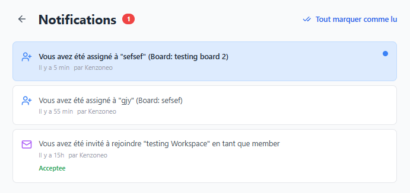
> *Capture : Page de notifications avec les differents types et etats*

### 11.4 Repondre a une Invitation

Pour les notifications d'invitation workspace :
1. Deux boutons apparaissent : **"Accept"** et **"Decline"**
2. Cliquez sur votre choix.
3. Un badge de statut s'affiche : **Vert (Accepted)** ou **Rouge (Declined)**

> 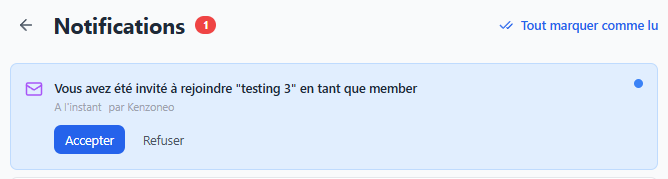
> *Capture : Notification d'invitation avec boutons Accept/Decline*

### 11.5 Naviguer depuis une Notification

Cliquez sur une notification de type **assignation** ou **echeance** pour etre redirige directement vers le board et la tache concernee.

---

## 12. Roles et Permissions

TaskFlow utilise un systeme de controle d'acces base sur les roles (RBAC).

### Roles disponibles

| Role | Icone | Description |
|------|-------|-------------|
| **Owner** | Couronne | Createur du workspace, tous les droits |
| **Admin** | Couronne | Gestion complete (settings, membres, boards) |
| **Member** | Bouclier | Creation et edition (boards, listes, taches) |
| **Viewer** | Oeil | Lecture seule (consultation uniquement) |

### Matrice des permissions

| Action | Owner | Admin | Member | Viewer |
|--------|-------|-------|--------|--------|
| Voir les boards | ✅ | ✅ | ✅ | ✅ |
| Creer des boards | ✅ | ✅ | ✅ | ❌ |
| Supprimer des boards | ✅ | ✅ | ✅ | ❌ |
| Creer/modifier des listes | ✅ | ✅ | ✅ | ❌ |
| Creer/modifier des taches | ✅ | ✅ | ✅ | ❌ |
| Drag & drop | ✅ | ✅ | ✅ | ❌ |
| Commenter | ✅ | ✅ | ✅ | ❌ |
| Gerer les settings du board | ✅ | ✅ | ❌ | ❌ |
| Inviter des membres | ✅ | ✅ | ❌ | ❌ |
| Modifier les roles | ✅ | ✅* | ❌ | ❌ |
| Supprimer le workspace | ✅ | ❌ | ❌ | ❌ |
| Inviter en tant qu'Admin | ✅ | ❌ | ❌ | ❌ |

*\* Un Admin ne peut pas modifier le role d'un autre Admin (seul l'Owner peut le faire).*

> 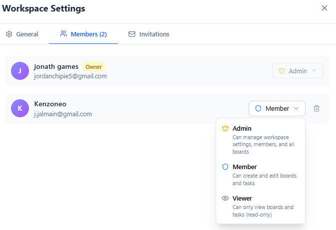
> *Capture : Interface de gestion des roles dans le panneau d'administration*

---

## 13. Panneau d'Administration Workspace

Accessible via le bouton **"Settings"** dans le header du workspace (Admins uniquement).

### Onglet General

- **Nom du workspace** : modifiable
- **Description** : modifiable
- **Couleur** : 10 couleurs predefinies
- **Bouton "Save Changes"**
- **Zone de danger** (Owner uniquement) :
  - Bouton **"Delete Workspace"**
  - Necessite de taper le nom du workspace pour confirmer
  - Action irreversible

> 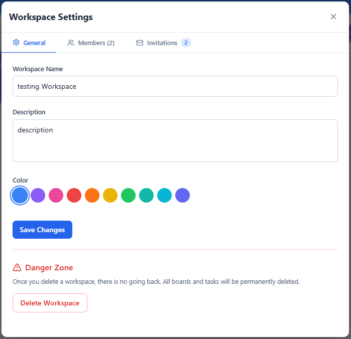
> *Capture : Onglet General du panneau d'administration workspace*

### Onglet Members

- **Liste des membres** avec :
  - Avatar et nom
  - Email
  - Dropdown de role (pour changer le role)
  - Bouton de suppression
- **Descriptions des roles** affichees en haut

> 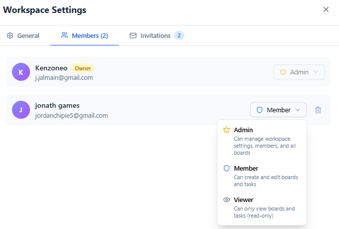
> *Capture : Onglet Members avec la liste et les controles de roles*

### Onglet Invitations

- **Formulaire d'invitation** :
  - Champ email
  - Dropdown de role
  - Bouton **"Send Invite"**
- **Invitations en attente** :
  - Email de l'invite
  - Role attribue
  - Nom de l'inviteur
  - Bouton **"Cancel"**

> 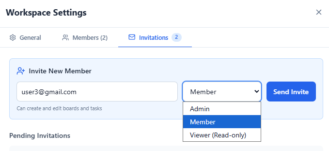
> *Capture : Interface d'envoi et de gestion des invitations*

---

## 14. Panneau d'Administration Board

Accessible via le bouton **"Settings"** dans le header du board (Admins uniquement).

### Onglet Background

Personnalisez l'arriere-plan du board :

- **10 presets** : couleurs unies et degrades
  - Couleurs : Bleu ciel, Violet, Vert, Orange, Rose, Gris
  - Degrades : Violet, Coucher de soleil, Ocean, Menthe
- **Couleur personnalisee** : via un color picker
- **Image URL** : collez l'URL d'une image
- Boutons **"Apply"** / **"Remove"**

> 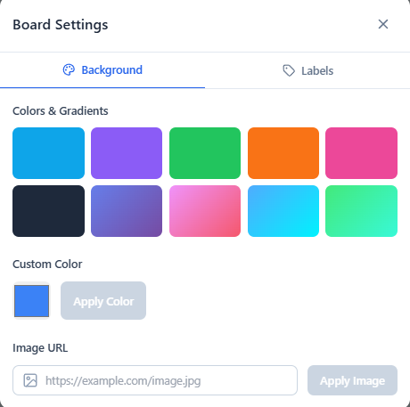
> *Capture : Options de personnalisation de l'arriere-plan du board*

### Onglet Labels

Gerez les labels (etiquettes) du board :

- **Liste des labels existants** : nom + couleur
- **Modifier un label** : cliquez dessus, editez le nom et la couleur
- **Supprimer un label** : icone poubelle
- **Creer un nouveau label** :
  1. Entrez un nom
  2. Selectionnez une couleur parmi 10 presets
  3. Cliquez sur **"Create"**

Couleurs de labels disponibles : Rouge, Orange, Ambre, Vert, Teal, Bleu, Indigo, Violet, Rose, Gris

> 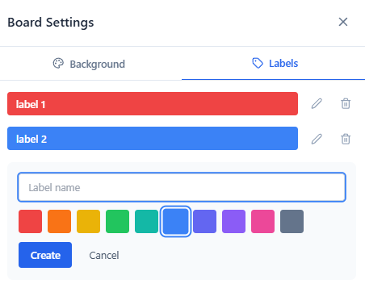
> *Capture : Interface de creation et gestion des labels du board*

---

## 15. Collaboration en Temps Reel

TaskFlow supporte la collaboration en temps reel. Les modifications sont instantanement visibles pour tous les utilisateurs connectes :

### Evenements synchronises en temps reel

| Categorie | Evenements |
|-----------|-----------|
| **Listes** | Creation, renommage, suppression, vidage, reordonnancement |
| **Taches** | Creation, modification, suppression, deplacement, reordonnancement |
| **Detail carte** | Labels, assignes, dates, checklists, commentaires |
| **Workspace** | Roles membres, invitations, parametres |
| **Board** | Fonds, labels, parametres |
| **Notifications** | Livraison en temps reel |

> **Note :** Sur les deployements serverless (ex: Vercel), les WebSockets ne sont pas disponibles. Les modifications locales sont toujours appliquees immediatement pour l'utilisateur qui les effectue. Les autres utilisateurs verront les changements au prochain rafraichissement de la page.

> 
> *Capture : Deux utilisateurs collaborant sur le meme board en temps reel*

---

## 16. Deconnexion

1. Cliquez sur le bouton **"Logout"** dans la barre de navigation (en haut a droite).
2. Vous serez redirige vers la page d'accueil.

> 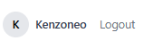
> *Capture : Emplacement du bouton de deconnexion dans la barre de navigation*

---

## Annexes

### A. Raccourcis Clavier

| Action | Raccourci |
|--------|-----------|
| Valider un titre de liste/carte | **Entree** |
| Annuler une edition | **Echap** ou clic exterieur |
| Nouvelle ligne dans description | **Shift + Entree** |
| Ajouter un element de checklist | **Entree** |

### B. Couleurs Disponibles

#### Workspaces (10 couleurs)
| Couleur | Hex |
|---------|-----|
| Bleu | #3b82f6 |
| Violet | #8b5cf6 |
| Rose | #ec4899 |
| Rouge | #ef4444 |
| Orange | #f97316 |
| Jaune | #eab308 |
| Vert | #22c55e |
| Teal | #14b8a6 |
| Cyan | #06b6d4 |
| Indigo | #6366f1 |

#### Boards (8 couleurs)
Bleu, Violet, Rose, Rouge, Orange, Jaune, Vert, Teal

#### Headers de Liste (9 options)
Defaut (transparent), Rouge, Orange, Ambre, Vert, Bleu, Indigo, Violet, Rose

#### Labels (10 presets)
Rouge, Orange, Ambre, Vert, Teal, Bleu, Indigo, Violet, Rose, Gris

---

*Fin du Guide Utilisateur - TaskFlow v2.0*
